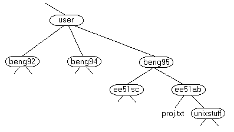
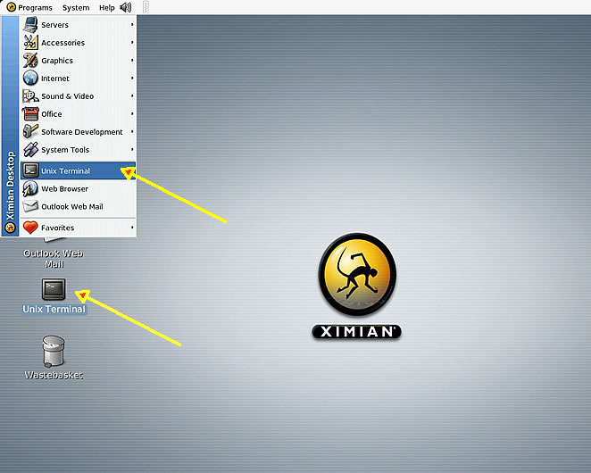
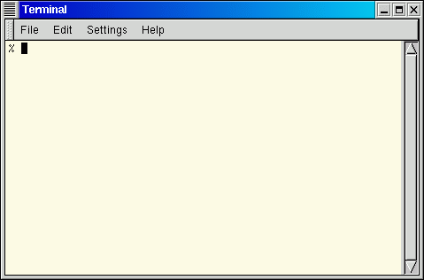

# Introduction to UNIX

This session concerns UNIX, which is a common operating system. By
operating system, we mean the suite of programs which make the computer
work. UNIX is used by the workstations and multi-user servers within the
school.

On X terminals and the workstations, X Windows provide a graphical
interface between the user and UNIX. However, knowledge of UNIX is
required for operations which aren't covered by a graphical program, or
for when there is no X windows system, for example, in a telnet session.

## The UNIX operating system
-------------------------

The UNIX operating system is made up of three parts; the kernel, the
shell and the programs.

### The kernel

The kernel of UNIX is the hub of the operating system: it allocates time
and memory to programs and handles the filestore and communications in
response to system calls.

As an illustration of the way that the shell and the kernel work
together, suppose a user types rm myfile (which has the effect of
removing the file **myfile**). The shell searches the filestore for the
file containing the program rm, and then requests the kernel, through
system calls, to execute the program rm on myfile. When the process rm
myfile has finished running, the shell then returns the UNIX prompt % to
the user, indicating that it is waiting for further commands.

### The shell

The shell acts as an interface between the user and the kernel. When a
user logs in, the login program checks the username and password, and
then starts another program called the shell. The shell is a command
line interpreter (CLI). It interprets the commands the user types in and
arranges for them to be carried out. The commands are themselves
programs: when they terminate, the shell gives the user another prompt
(% on our systems).

The adept user can customise his/her own shell, and users can use
different shells on the same machine. Staff and students in the school
have the tcsh shell by default.

The tcsh shell has certain features to help the user inputting commands.

Filename Completion - By typing part of the name of a command, filename
or directory and pressing the \[Tab\] key, the tcsh shell will complete
the rest of the name automatically. If the shell finds more than one
name beginning with those letters you have typed, it will beep,
prompting you to type a few more letters before pressing the tab key
again.

History - The shell keeps a list of the commands you have typed in. If
you need to repeat a command, use the cursor keys to scroll up and down
the list or type history for a list of previous commands.

Files and processes
-------------------

Everything in UNIX is either a file or a process.

A process is an executing program identified by a unique PID (process
identifier).

A file is a collection of data. They are created by users using text
editors, running compilers etc.

Examples of files:

-   a document (report, essay etc.)
-   the text of a program written in some high-level programming
    language
-   instructions comprehensible directly to the machine and
    incomprehensible to a casual user, for example, a collection of
    binary digits (an executable or binary file);
-   a directory, containing information about its contents, which may be
    a mixture of other directories (subdirectories) and ordinary files.

The Directory Structure
-----------------------

All the files are grouped together in the directory structure. The
file-system is arranged in a hierarchical structure, like an inverted
tree. The top of the hierarchy is traditionally called **root**.

In the diagram above, we see that the directory `ee51ab` contains the
subdirectory `unixstuff` and a file `proj.txt`

Starting an Xterminal session
-----------------------------

To start an Xterm session, click on the Unix Terminal icon on your
desktop, or from the drop-down menus

 

An Xterminal window will appear with a Unix prompt, waiting for you to
start entering commands.

{width="479"
height="316"}

## Unix Shell Types 

### List of common unix shells 

* Bourne shell (sh)
* C shell (csh)
* TC shell (tcsh)
* Korn shell (ksh)
* Bourne Again shell (bash)
* Z shell (zsh)

### To check current login shell 

    echo $0
    -bash

    cat /etc/shells 
    /bin/sh
    /bin/ash
    /bin/bash

    # to change shell for `username`
    usermod -s /bin/bash <username>

    # alternate method with chsh 
    chsh -s /bin/bash <username>

M.Stonebank@surrey.ac.uk, © 9th October 2000
